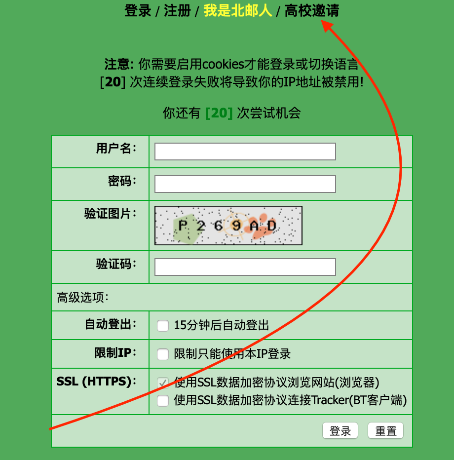
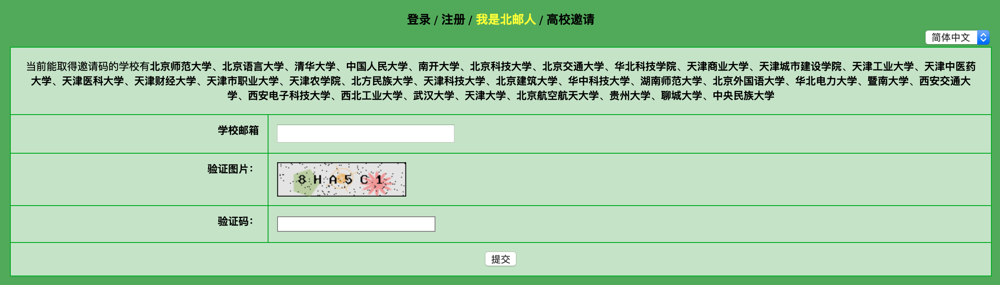
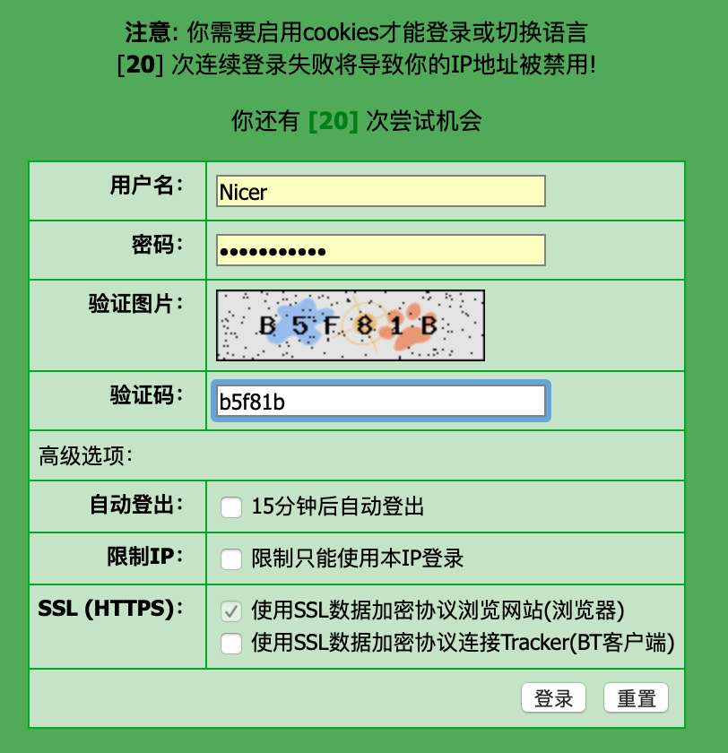
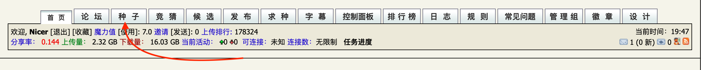
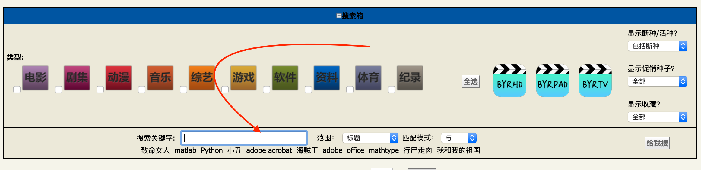

# 北邮人网站使用方法
>建议使用电脑来访问这个页面
## 1.注册与登陆
点击<a href="https://bt.byr.cn" target="_blank">北邮人BT</a>来进入此网站；
然后看到如下页面：

 
 
 点击箭头处进入下一页面：
 按要求填写即可
 
 
 
 **然后使用微信企业号-南开微应用-邮箱-查收验证码
 而后继续按照网页提示操作，而后登陆即可**
 
 
 
 
 ---
## 2.资源的检索与下载
 
 >可以在主页逛一逛，下方有一些搞笑的图片
 

 
 点击种子可以进入网站资源界面：
 
  
  
 可以在这里搜索并且可以筛选分类：
 
  
 
 
 然后可以下载自己中意的种子还有字幕：
 
  
 
 
 **一定要继续坚持看下去！！！**
 
 
 ---
## 3.注意事项
 
  [北邮人Q&A](https://bt.byr.cn/faq.php) 
 
 **以下是比较重要的内容**
 
 [关于下载上传](https://bt.byr.cn/faq.php#question31)
 
 [关于客户端的使用](https://bt.byr.cn/faq.php#question41)
 
 *不要使用迅雷下载*
 
 *不要使用迅雷下载*
 
 *不要使用迅雷下载*

 [切尔诺贝利美剧](https://bt.byr.cn/details.php?id=291078&hit=1)
 
 
 
---
## 4.关于免流
### 可以参考 "注意事项"中北邮人官网的免流方法（复杂）
 [免流设置](https://bt.byr.cn/faq.php#question42)
### 或者！！！进入南开大学校园网网关 (Easy)
    PS:不退出登陆也可以免流量，但是有一定
 [网关系统](http://202.113.18.106)
  点击注销(logout)
 **注意进入自服务关闭自动mac无感知登陆**
     
 [自服务](http://netservice.nankai.edu.cn/Self/login/)
 
 而后在不登陆的情况下，你会发现，这个网站还能打开
 
 然后开始白嫖。😂😂😂
    
可以下载网站上所有资源！！！但注意要上传来把文件分享给大家
